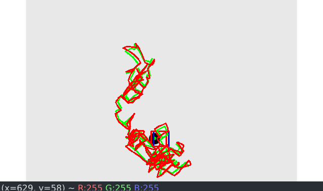
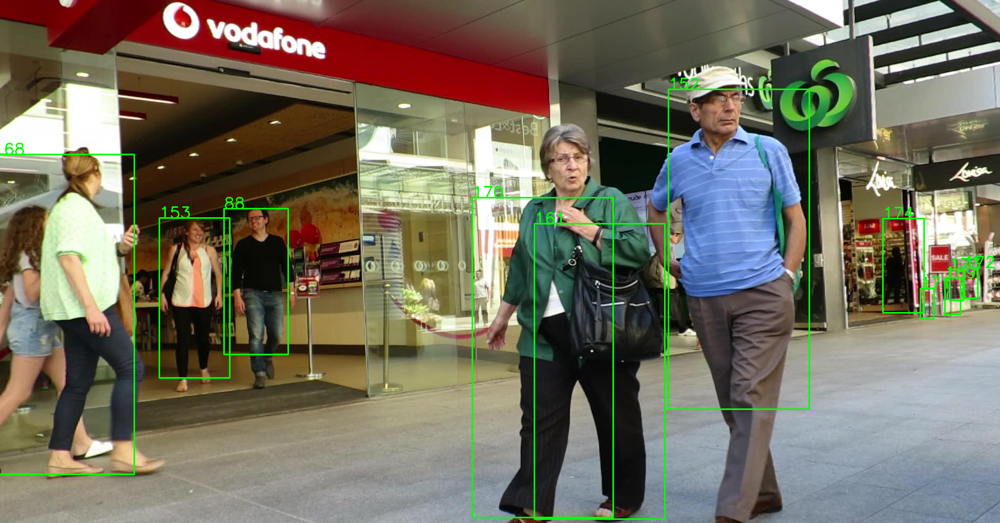
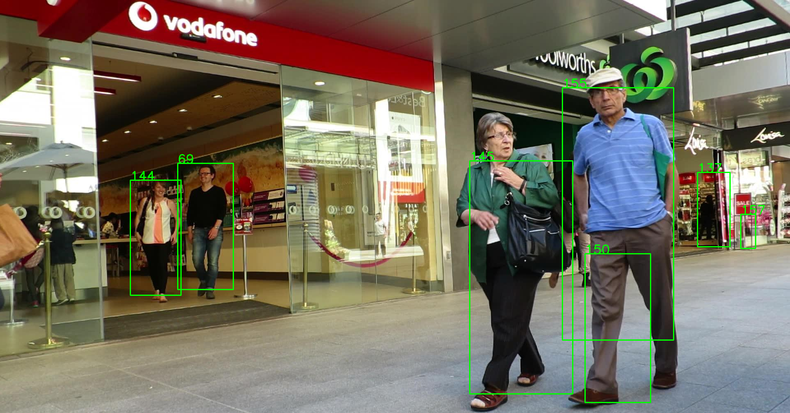
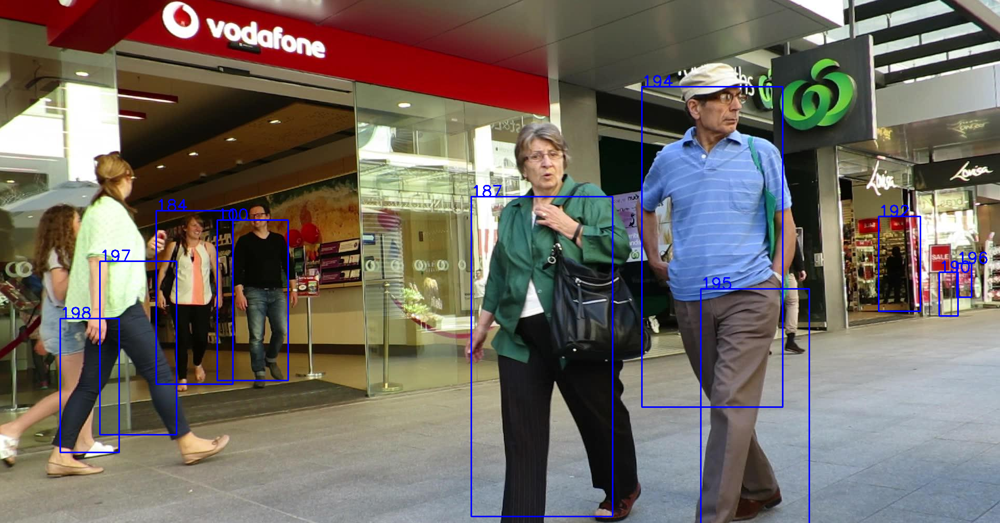

# Projet Visual Object Tracking
* Autheur: Léo Sron
* Promotion SCIA 2024

## Introduction
Ce projet a pour but de mettre en place un système de tracking d'objets dans une vidéo.
Le projet est divisé en 5 parties:
* **TP1**: Prédiction de la position d'une balle se déplaçant aléatoirement dans une vidéo à l'aide d'un filtre de Kalman.
* **TP2**: Tracking d'objets dans une vidéo à l'aide d'un algorithme *glouton* évaluant l'intersection sur union (IoU) entre les bounding boxes.
* **TP3**: Tracking d'objets dans une vidéo à l'aide de l'algorithme *hongrois* évaluant l'intersection sur union (IoU) entre les bounding boxes.
* **TP4**: Tracking d'objets dans une vidéo à l'aide de l'algorithme *hongrois* évaluant l'intersection sur union (IoU) entre les bounding boxes et d'un filtre de Kalman.
* **TP5**: Ajout d'un modèle de deep learning permettant de capturer les informations sémantiques des objets à tracker.

## Structure du projet
```
.
├── README.md
├── requirements.txt
├── report_images                   // Images pour le rapport
├── src
│   ├── Detector.py
│   ├── KalmanFilter.py
│   ├── objTracking.py              // Code pour le TP1
│   ├── IoUTracker.py               // Code pour le TP2 et TP3 (greedy et hungarian)
│   └── KalmanIoUTracker.py         // Code pour le TP4 (Kalman + Hungarian)
├── results                         // Dossier contenant les résultats des TP2 et TP3
│   ├── results_Kalman.txt
│   └── results_TP3.txt 
└── data
    ├── randomball.avi
    ├── det
    │   └── det.txt
    ├── gt
    │   └── gt.txt
    └── img1
        ├── 000001.jpg
        └──...
```
Le programme implémentant les TP2 et TP3 se trouve dans le fichier `IoUTracker.py`. Pour lancer le programme en utilisant un algorithme ou l'autre, il faut exécuter la commande suivante:
```
python IoUTracker.py greedy
```
ou
```
python IoUTracker.py hungarian
```

## TP1
Le filtre de Kalman est implémenté dans la classe `KalmanFilter.py`. Le détecteur utilisé pour détecter la boule était fourni et permet de détecter le centroïde de l'objet.  
Ainsi, avec les méthodes `predict()` et `update()`, on peut prédire la position de la boule dans la vidéo.  
Le pogramme lance la vidéo avec le centre de la boule, l'estimation de la trajectoire et la prédiction de la trajectoire. Une ligne continue est tracée pour suivre le déplacement de la boule.



## TP2
Le principe du tracking par intersection sur union (IoU) est de calculer le score d'intersection sur union entre les bounding boxes de deux images successives.  
Si le score est supérieur à un certain seuil, on considère que les deux bounding boxes sont les mêmes objets et on associe les trackers.  
Pour ce faire, j'ai implémenté la fonction `compute_similarity_matrix()` qui calcule la matrice de similarité entre les bounding boxes de deux images successives.  
Ensuite, l'association des trackers se fait en fonction de la matrice de similarité et du seuil `sigma_iou` avec la fonction `greedy_assignment()`.  
Enfin, on met à jour les trackers avec la fonction `update_trackers()`.  
Le programme lance la vidéo avec les bounding boxes des objets trackés et l'id du tracker associé.



### Algorithme glouton
```python
def greedy_assignment(similarity_matrix, previous_tracks, sigma_iou):
    assignments = []
    used_cols = []
    for i in range(similarity_matrix.shape[1]):
        max_col = np.argsort(-(similarity_matrix[:, i]))
        for col in max_col:
            if similarity_matrix[col][i] < sigma_iou:
                break
            if col not in used_cols:
                assignments.append((i, previous_tracks[col]))
                used_cols.append(col)
                break
    return assignments
```

## TP3
Pour le TP3, le principe était le même que pour le TP2 mais avec l'algorithme hongrois pour l'association des trackers.
L'algorithme *hongrois* consiste à trouver l'association optimale entre les trackers et les bounding boxes en maximisant la somme des scores d'intersection sur union.
Pour ce faire, j'ai implémenté la fonction `hungarian_assignment()` en utilisant la librairie `scipy.optimize.linear_sum_assignment` qui permet de résoudre le problème d'association optimale.  
L'algorithme principal reste le même que pour le TP2. C'est pour cette raison que j'ai décidé de regrouper les deux TP dans le même fichier `IoUTracker.py`.



### Algorithme hongrois
```python
def hungarian_assignment(similarity_matrix, previous_tracks, sigma_iou):
    clear_sim_matrix = similarity_matrix.copy()
    for i in range(len(clear_sim_matrix)):
        for j in range(len(clear_sim_matrix[i])):
            if clear_sim_matrix[i][j] < sigma_iou:
                clear_sim_matrix[i][j] = 0
    rows, cols = linear_sum_assignment(-clear_sim_matrix)
    assignments = []
    for i in range(len(rows)):
        if clear_sim_matrix[rows[i]][cols[i]] != 0:
            assignments.append((cols[i], previous_tracks[rows[i]]))
    return assignments
```

## Algorithme principal
```python
tracking_method = sys.argv[1]

det = pd.read_csv('../data/det/det.txt', sep=',', index_col=0)
frames = det.index.unique()
sigma_iou = 0.2
tracks = update_tracks(0, [], len(det.loc[1]))

for i in range(1, len(frames)-1):
    frame1 = det.loc[i]
    frame2 = det.loc[i + 1]
    similarity_matrix = compute_similarity_matrix(frame1, frame2)
    if tracking_method == 'greedy':
        assignments = greedy_assignment(similarity_matrix, tracks, sigma_iou)
    elif tracking_method == 'hungarian':
        assignments = hungarian_assignment(similarity_matrix, tracks, sigma_iou)
    else:
        print('Invalid tracking method')
        return
    tracks = update_tracks(max(tracks), assignments, len(frame2))
    display_boxes(frame_to_boxes(frame2), frames[i + 1], tracks)
    cv2.waitKey(10)
```

## TP4
Le TP4 consistait à ajouter un filtre de Kalman aux algorithmes du TP précédent afin d'utiliser la prédiction du filtre de Kalman pour l'association des trackers et des bounding boxes à la place de l'image précédente.
Pour ce faire, j'ai utilisé 3 dictionnaires pour stocker les centroïdes, les caractéristiques des bounding boxes (largeur et hauteur) et les filtres de Kalman.  
```
centroids       =  {numero de la frame: {id du tracker: [x, y]}}
original_boxes  =  {numero de la frame: {id du tracker: [w, h]}}
kalman_filters  =  {numero de la frame: {id du tracker: KalmanFilter}}
```
Je peux grâce à ces dictionnaires: 
* reconstruire les bounding boxes à partir des centroïdes et des caractéristiques des bounding boxes. (fonction `centroids_to_boxes()`)
* prédire et mettre à jour la position des bounding boxes à partir des filtres de Kalman en accédant aux méthodes de la classe du TP1.
* reconstruire les frames précédentes à partir de `centroids` et `original_boxes` afin de les utiliser pour calculer la matrice de similarité. (fonction `original_to_frame()`)



### Algorithme principal
L'algorithme principal est le suivant:
```python
tracks = update_tracks(0, [], len(det.loc[1]))
for i in range(1, len(tracks) + 1):
    kalman_filters[1][i] = KalmanFilter(dt, u_x, u_y, std_acc, x_std_meas, y_std_meas)
    kalman_filters[1][i].predict()
    original_boxes[1][i] = (det.loc[1].iloc[i - 1]['bb_width'], det.loc[1].iloc[i - 1]['bb_height'])
    centroids[1][i] = compute_centroid((det.loc[1].iloc[i - 1]['bb_left'], det.loc[1].iloc[i - 1]['bb_top'],
                                        det.loc[1].iloc[i - 1]['bb_width'], det.loc[1].iloc[i - 1]['bb_height']))
    kalman_filters[1][i].update(centroids[1][i])

for i in range(2, len(frames)):
    frame1 = original_to_frame(original_boxes[i - 1], centroids[i - 1])
    frame2 = det.loc[i]
    similarity_matrix = compute_similarity_matrix(frame1, frame2)
    assignments = hungarian_assignment(similarity_matrix, tracks, sigma_iou)
    tracks = update_tracks(max(tracks), assignments, len(frame2))

    setup_dict_id(kalman_filters, original_boxes, centroids, kalman_filters, i)
    for j in range(len(tracks)):
        if tracks[j] in kalman_filters[i - 1].keys():
            kalman_filters[i][tracks[j]] = kalman_filters[i - 1][tracks[j]]
            kalman_filters[i][tracks[j]].predict()
            original_boxes[i][tracks[j]] = (frame2.iloc[j]['bb_width'], frame2.iloc[j]['bb_height'])
            centroids[i][tracks[j]] = (kalman_filters[i][tracks[j]].xk[0][0], kalman_filters[i][tracks[j]].xk[0][1])
            kalman_filters[i][tracks[j]].update(centroids[i][tracks[j]])
        else:
            kalman_filters[i][tracks[j]] = KalmanFilter(dt, u_x, u_y, std_acc, x_std_meas, y_std_meas)
            kalman_filters[i][tracks[j]].predict()
            original_boxes[i][tracks[j]] = (frame2.iloc[j]['bb_width'], frame2.iloc[j]['bb_height'])
            centroids[i][tracks[j]] = compute_centroid((frame2.iloc[j]['bb_left'], frame2.iloc[j]['bb_top'],
                                                        frame2.iloc[j]['bb_width'], frame2.iloc[j]['bb_height']))
            kalman_filters[i][tracks[j]].update(centroids[i][tracks[j]])
```
Une première boucle permet d'initialiser les trackers et les filtres de Kalman pour la première frame.  
Ensuite, on reconstruit la frame précédente à partir des centroïdes et des caractéristiques des bounding boxes.  
On calcule la matrice de similarité entre la frame précédente et la frame actuelle.  
On associe les trackers et les bounding boxes à l'aide de l'algorithme hongrois.  
On met à jour les trackers et les filtres de Kalman.  
Si un tracker n'est pas associé à une bounding box, on crée un nouveau filtre de Kalman pour ce tracker.
Sinon, on récupère le filtre de Kalman associé au tracker et on le met à jour.

## Benchmark
L'évaluation des algorithmes de tracking se fait à l'aide du projet `TrackEval` disponible sur [GitHub](https://github.com/JonathonLuiten/TrackEval).

Les algorithmes des TP2, TP3 et TP4 ont été lancé sur le jeu d'image MOT 15 ADL-Rundle-6.  
Voici les résultats obtenus:
* Pour le TP3:
```
HOTA: TP3-pedestrian               HOTA      DetA      AssA      DetRe     DetPr     AssRe     AssPr     LocA      OWTA      HOTA(0)   LocA(0)   HOTALocA(0)
ADL-Rundle-6                       17.348    32.142    9.6975    41.008    50.694    10.097    61.661    75.15     19.728    25.149    63.154    15.882    

CLEAR: TP3-pedestrian              MOTA      MOTP      MODA      CLR_Re    CLR_Pr    MTR       PTR       MLR       sMOTA     CLR_TP    CLR_FN    CLR_FP    IDSW      MT        PT        ML        Frag      
ADL-Rundle-6                       16.011    71.73     21.322    51.108    63.179    4.1667    87.5      8.3333    1.563     2560      2449      1492      266       1         21        2         269       

Identity: TP3-pedestrian           IDF1      IDR       IDP       IDTP      IDFN      IDFP      
ADL-Rundle-6                       19.512    17.648    21.816    884       4125      3168      

Count: TP3-pedestrian              Dets      GT_Dets   IDs       GT_IDs    
ADL-Rundle-6                       4052      5009      454       24        
```

* Pour le TP4:
```
HOTA: TP4-pedestrian               HOTA      DetA      AssA      DetRe     DetPr     AssRe     AssPr     LocA      OWTA      HOTA(0)   LocA(0)   HOTALocA(0)
ADL-Rundle-6                       10.739    26.139    4.5788    37.253    38.167    4.8665    56.428    70.114    12.904    19.863    53.207    10.569       

CLEAR: TP4-pedestrian              MOTA      MOTP      MODA      CLR_Re    CLR_Pr    MTR       PTR       MLR       sMOTA     CLR_TP    CLR_FN    CLR_FP    IDSW      MT        PT        ML        Frag      
ADL-Rundle-6                       -17.888   66.578    -11.04    43.282    44.344    0         91.667    8.3333    -32.353   2168      2841      2721      343         225       137       138       629       

Identity: TP4-pedestrian           IDF1      IDR       IDP       IDTP      IDFN      IDFP      
ADL-Rundle-6                       9.7191    9.6027    9.8384    481       4528      4408       

Count: TP4-pedestrian              Dets      GT_Dets   IDs       GT_IDs    
ADL-Rundle-6                       4889      5009      940       24           
```

L'algorithme ayant les meilleurs résultats est celui du TP3 sans le filtre de Kalman. Il semblerait que le filtre de Kalman ait du mal à prédire la position des bounding boxes.
Cela peut être dû aux détections contenues dans le fichier `det.txt` qui semble contenir des artéfacts. On peut notamment remarquer des bounding boxes se téléportant d'un endroit à un autre et rétrécissant ou s'agrandissant de manière anormale.
Cela peut également être dû à la façon dont j'ai enregistré les résultats dans le fichier `results_Kalman.txt`.